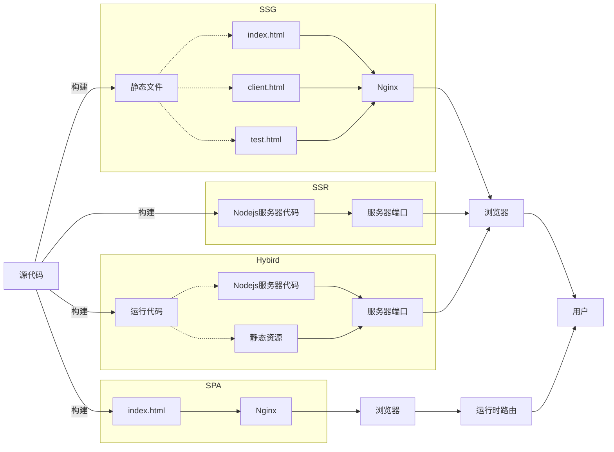
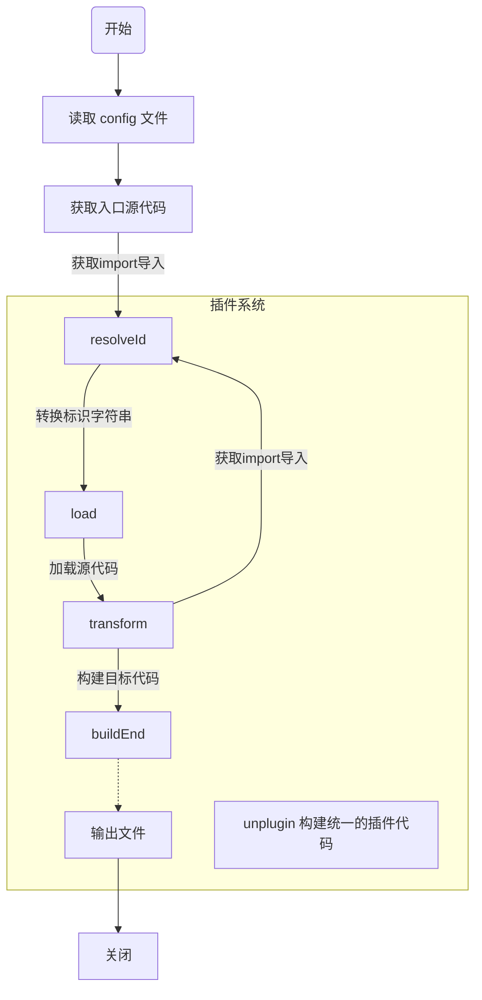
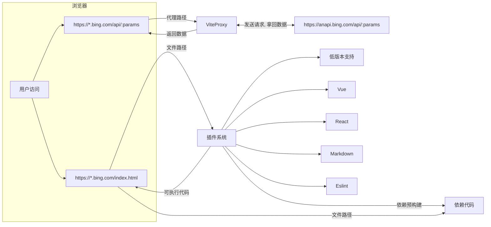

## 前端构建器细节

### 构建模式的区别

```mermaid
flowchart LR
    User[用户]
    Browser[浏览器] --> User
    SourceCode[源代码] --构建--> Z[静态文件]
    SourceCode --构建-->i
    SourceCode --构建--> Nodejs服务器代码 
    SourceCode --构建--> R[运行代码]
    

    Nginx --> Browser
    服务器端口  --> Browser 
    P --> Browser

    C --> B[浏览器]--> 运行时路由 -->User

    subgraph SSG
        Z -.-> index.html --> Nginx  
        Z -.-> client.html --> Nginx
        Z -.-> test.html --> Nginx
    end
    subgraph SPA
        i[index.html]  --> C[Nginx] 
    end


    subgraph SSR
        Nodejs服务器代码 --> 服务器端口  
    end

   
    subgraph Hybird
        R -.-> N[Nodejs服务器代码] --> P[服务器端口] 
        R -.->  静态资源 --> P
    end

```
   

### 前端构建流程

```mermaid
flowchart TB

    open(开始) --> Config[读取 config 文件]
    Entry[获取入口源代码]


    Config  --> Entry 
    writeBundle[输出文件] --> 关闭
    Entry -- 获取import导入-->  resolveId 

    subgraph 插件系统
          resolveId --转换标识字符串--> load

         transform -- 获取import导入 ----> resolveId
         load --加载源代码 --> transform --构建目标代码--> buildEnd -.-> writeBundle  
         unplugin[unplugin 构建统一的插件代码]
    end    
```

### 开发服务器

```mermaid
flowchart LR
    A[https://anapi.bing.com/api/:params]
    B[https://*.bing.com/api/:params]
    C[https://*.bing.com/index.html]
    
    subgraph 浏览器
        用户访问 --> B 
        用户访问 --> C 
    end

    B--代理路径--> ViteProxy <--发送请求, 拿回数据--> A
    ViteProxy --返回数据--> B

    C --文件路径--> 插件系统
    插件系统 --可执行代码-->C


    插件系统 --依赖预构建----> 依赖代码
    C --文件路径--> 依赖代码


    插件系统 --> 低版本支持
    插件系统 --> Vue
    插件系统 --> React
    插件系统 --> Markdown
    插件系统 --> Eslint
```

