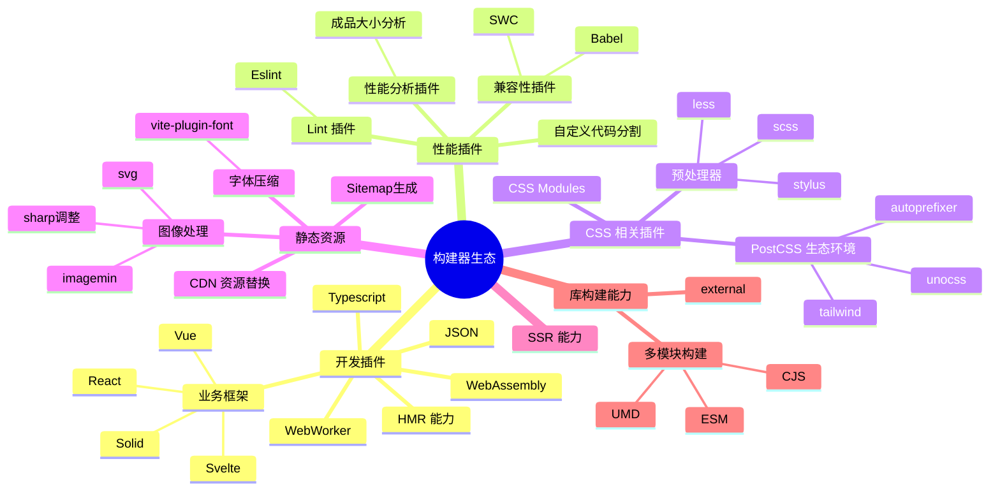

## 前端构建器生态环境

```mermaid
mindmap
  root((构建器生态))
    开发插件
        业务框架
            Vue
            React
            Solid
            Svelte
        Typescript
        WebWorker
        WebAssembly
        JSON
        HMR 能力
    性能插件
        兼容性插件
            Babel
            SWC
        性能分析插件
            成品大小分析
        Lint 插件
            Eslint
        自定义代码分割
    CSS 相关插件
        预处理器
            less
            scss
            stylus
        PostCSS 生态环境
            tailwind
            unocss
            autoprefixer
        CSS Modules
    静态资源
        图像处理
            imagemin
            sharp调整
            svg
        字体压缩
            vite-plugin-font
        Sitemap生成
        CDN 资源替换
    SSR 能力
    库构建能力
        多模块构建
            CJS
            ESM
            UMD
        external
        
```

