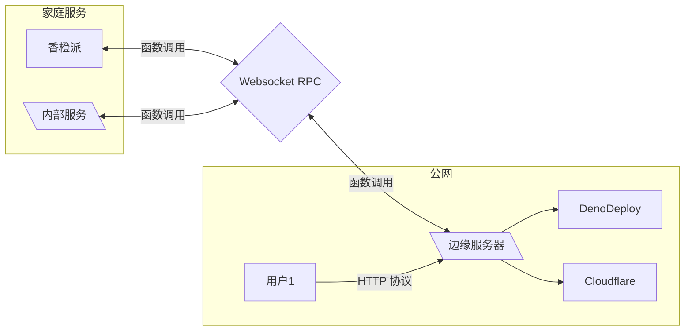

# 家庭服务

```mermaid
flowchart LR
    WB{Websocket RPC}
    香橙派 <--函数调用--> WB <--函数调用--> 边缘服务器
    内部服务[\内部服务\]<--函数调用--> WB

    subgraph 家庭服务
        香橙派
        内部服务
    end

    subgraph 公网
        边缘服务器[\边缘服务器\] --> DenoDeploy
        边缘服务器 --> Cloudflare

        用户1 -- HTTP 协议 --> 边缘服务器
    end

```
