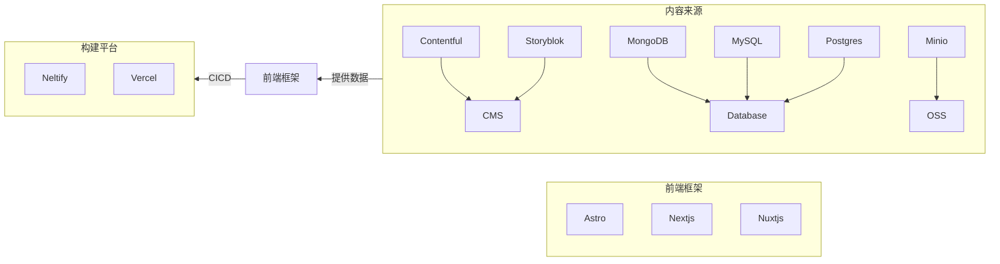

# my-mind

## JAMStack



## 中文网字计划架构

```mermaid
flowchart BT
    FontSubset{{cn-font-split}}
    Plugin{{vite-plugin-font}}
    FontSharp{{font-sharp}}
    FontStorage[\字体仓库\]
    FontPage[\网站前端\]
    DenoDeploy[Deno Deploy]

    subgraph 字体分包引擎
    Harfbuzz -- TTF子集化 --> FontSubset
    opentype.js --字体Feature--> FontSubset
    Woff2 -- TTF转Woff2 --> FontSubset
    WoffBuild[@napi-rs/woff-build] -- TTF转Woff2 --> FontSubset
    Harfbuzz -- 字体渲染 --> FontSharp --> FontSubset
    end

    subgraph 前端领域插件
    FontSubset --> Rspack --> Plugin
    FontSubset --> Vite --> Plugin
    FontSubset --> Webpack --> Plugin
    FontSubset --> Next --> Plugin
    FontSubset --> Nuxt --> Plugin
    end


    subgraph 中文网字计划前端
    FontSubset -- 全量分包 --> FontStorage
    Plugin -- 首屏优化 --> FontPage
    Clarity -- 前端监控 --> FontPage
    Netlify -- 网站部署 --> FontPage
    FontStorage -- 网站部署 --> Netlify
    Astro -- SSG渲染 --> FontPage
    end

    subgraph 中文网字计划后端
    FontStorage -- 静态资源托管 --> ImageKit
    ImageKit -- 动态网关管理 --> DenoDeploy
    DenoDeploy -- 网关拦截 --> FontPage
    Sentry -- 后端监控 --> DenoDeploy
    end
```
