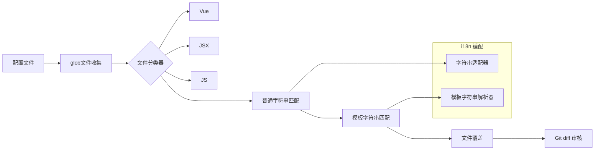
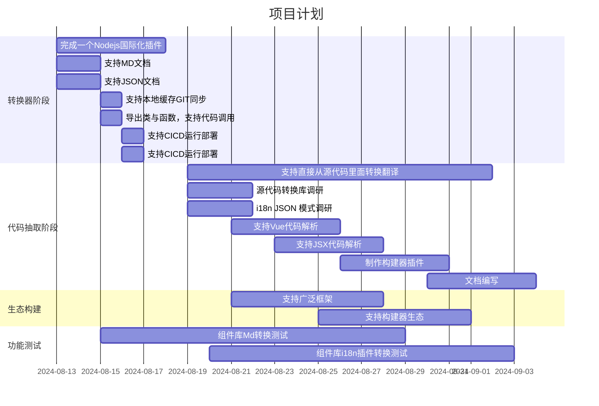

# i18n 自动生成

```mermaid
graph LR
    配置文件 --> glob文件收集
    glob文件收集 --> 文件分类器{文件分类器} --> Vue
    文件分类器 --> JSX
    文件分类器 --> JS
    文件分类器 ----> 普通字符串匹配 
    普通字符串匹配 ---> 模板字符串匹配

    普通字符串匹配 ---> 字符串适配器
    模板字符串匹配 ---> 模板字符串解析器

    subgraph i18n 适配
    字符串适配器
    模板字符串解析器
    end

    模板字符串匹配 ---> 文件覆盖 ---> Git[Git diff 审核] 
```

```mermaid
gantt
    title 项目计划
    dateFormat  YYYY-MM-DD
    section 转换器阶段
    完成一个Nodejs国际化插件 :b1, 2024-08-13, 5d
    支持MD文档           :b1, 2024-08-13, 2d
    支持JSON文档         :b2,  2024-08-13, 2d
    支持本地缓存GIT同步   :b3,  2024-08-15, 1d
    导出类与函数，支持代码调用  :b4,  2024-08-15, 1d
    支持CICD运行部署      :b4,  2024-08-16, 1d
    支持CICD运行部署      :b4,  2024-08-16, 1d
    
    section 代码抽取阶段
    支持直接从源代码里面转换翻译 :c1,  2024-08-19, 14d
    源代码转换库调研            :c2,  2024-08-19, 3d
    i18n JSON 模式调研          :c12,  2024-08-19, 3d
    支持Vue代码解析             :c3,  2024-08-21, 5d
    支持JSX代码解析             :c4,  2024-08-23, 5d
    制作构建器插件              :c5,  2024-08-26, 5d
    文档编写                    :c6,  2024-08-30, 5d
    
    section 生态构建
    支持广泛框架                :e24,  2024-08-21, 7d
    支持构建器生态                :e24,  2024-08-25, 7d

    section 功能测试
    组件库Md转换测试             :d0,  2024-08-15, 14d
    组件库i18n插件转换测试       :d1,  2024-08-20, 14d
```

